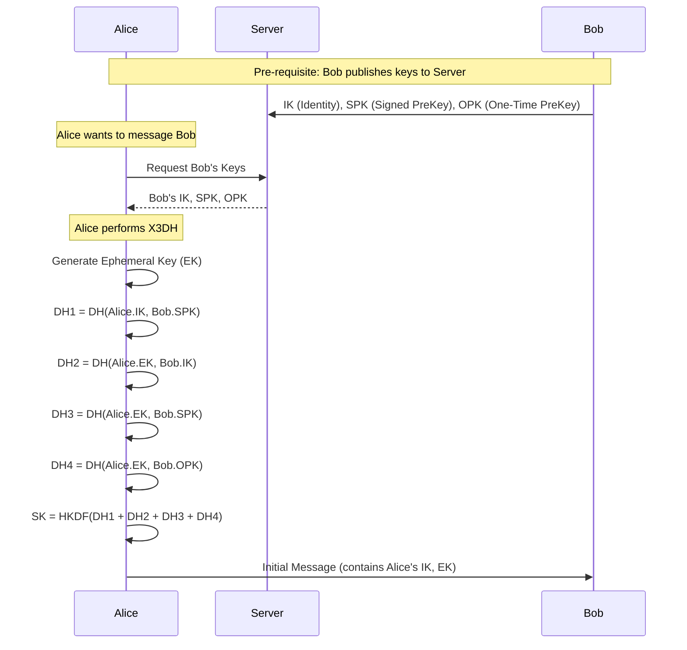
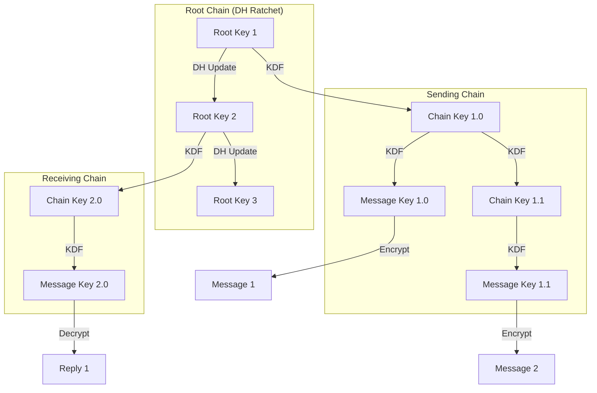

# Secure Double Ratchet Messenger

A modern, secure messaging application implementing the **Double Ratchet Algorithm** for end-to-end encryption, featuring a sleek dark-mode GUI and Dockerized backend.


## 🚀 Features

- **End-to-End Encryption (E2EE)**: Messages are encrypted on the sender's device and only decrypted by the recipient. The server never sees the plaintext.
- **Double Ratchet Algorithm**: Provides both **Forward Secrecy** (past messages remain secure if a key is compromised) and **Post-Compromise Security** (future messages are secure after a compromise is healed).
- **X3DH Key Agreement**: Secure initial key exchange using Extended Triple Diffie-Hellman.
- **Modern GUI**: Built with `customtkinter`, featuring a responsive dark theme, sidebar navigation, and real-time updates.
- **Dockerized Backend**: Server and MySQL database are containerized for easy deployment and isolation.
- **Local Persistence**: User keys and message history are encrypted and stored locally using AES.

## 🔒 Security Architecture

This application uses state-of-the-art cryptographic primitives to ensure message confidentiality and integrity.

### Cryptographic Primitives
- **Curve25519**: For Elliptic Curve Diffie-Hellman (ECDH) key exchange.
- **Ed25519**: For digital signatures and authentication.
- **AES-256-CBC**: For message encryption (with PKCS7 padding).
- **HMAC-SHA256**: For key derivation (HKDF).
- **PyNaCl**: High-level crypto library for networking and cryptography.

### 1. X3DH Key Agreement (Initial Setup)
When a user creates a group or joins one, an X3DH exchange occurs to establish a shared secret key.



### 2. The Double Ratchet (Messaging)
Once the shared secret (SK) is established, the Double Ratchet algorithm is used to encrypt every message with a unique key.

*   **Diffie-Hellman Ratchet**: Updates the "Root Key" whenever a message is exchanged, providing post-compromise security.
*   **Symmetric Ratchet**: Derives new "Message Keys" for each message sent in a row, providing forward secrecy.



## 🛠️ Installation & Usage

### Prerequisites
- **Docker Desktop** (for the server and database)
- **Python 3.10+**

### 1. Start the Backend
Run the server and database containers:
```bash
docker-compose up -d --build
```

### 2. Install Client Dependencies
Create a virtual environment and install requirements:
```bash
python -m venv .venv

# Windows
.venv\Scripts\activate

# Mac/Linux
source .venv/bin/activate

pip install -r requirements.txt
```

### 3. Run the Client
Launch the GUI application:
```bash
python gui_app.py
```
You can run multiple instances of `gui_app.py` to simulate multiple users (e.g., Alice and Bob).

## 📂 Project Structure

- `gui_app.py`: Main entry point for the GUI client.
- `client_controller.py`: Handles networking, user session, and bridges GUI with logic.
- `client_classes.py`: Core cryptographic logic (User, Member, Group, Ratchet).
- `server.py`: Python server handling message routing (encrypted blobs only).
- `db_model.py`: SQLAlchemy database models.
- `Dockerfile.server` & `docker-compose.yml`: Container configuration.

## ⚠️ Disclaimer
This project is for educational purposes. While it implements standard cryptographic algorithms, it has not undergone a professional security audit.
